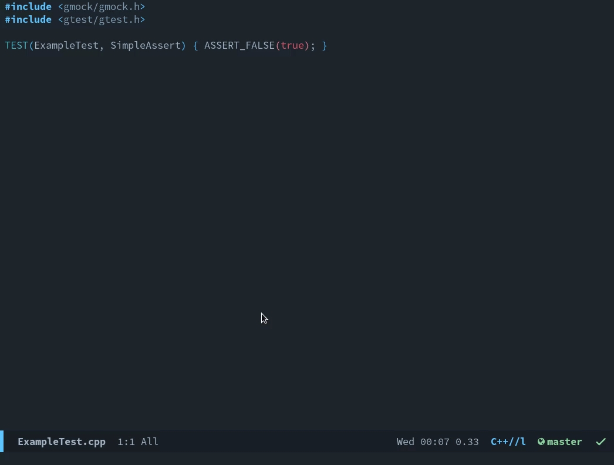

# counsel-ctest
An emacs package that integrates ivy/counsel with ctest.

This package is inspired by
[helm-ctest](https://github.com/danlamanna/helm-ctest), huge thanks to the
author.



# Installation
This package is not yet in MELPA, so currently the only possible way is to
install it manually.

## Manual installation
First, clone this repo. Then, load the package with the method of your
choice (e.g. `load-path`/`require`, `use-package` etc). An example with
`use-package`:

``` emacs-lisp
(use-package counsel-ctest
  :load-path "~/.emacs.local/counsel-ctest"
  :custom
  (counsel-ctest-env "CLICOLOR_FORCE=1"))
```

## Usage
In your project it is sufficient to invoke `M-x counsel-ctest`. You will be
prompted for the directory with ctest tests. After this, you will see a list of
the available tests. You can pick any test or even a group of tests (with the
help of `ivy-mark`). Note that the directory you have selected will be cached,
so each subsequent call to `counsel-ctest` will be run in that directory. If you
want to force pick another directory, use the prefix argument: `C-u M-x
counsel-ctest`.

An alternative solution is to add `counsel-ctest-dir` variable to the project
`dir-locals.el`. This will remove the need to select the ctest directory
manually after emacs restarts and during switching between different projects.

### Customization
This package contains several variables that allow certain customization on the
per-project basis. They have sensible defaults but it is strongly recommended to
set some of them in `dir-locals.el` for each project separately.

* `counsel-ctest-cmd` - command that is used to run ctest, defaults to "ctest".
  If you wish to use the custom ctest binary, point this variable to it, e.g.
  `(setq counsel-ctest-cmd "path/to/custom/ctest-bin)`.
* `counsel-ctest-dir` - directory from where to run the
  `counsel-ctest-candidates-cmd` and perform ctest tests execution. Default
  value is `nil`. When `nil` the user is asked for the directory
  interactively. This is the primary candidate for being a dir-local
  variable. **Note** that currently, when setting this in `dir-locals.el` you
  have to provide the **absolute** path. **Relative** paths **do not work** for
  now.
* `counsel-ctest-env` - environment variable settings for the ctest tests
  execution. The default value is `"CLICOLOR_FORCE=1 CTEST_OUTPUT_ON_FAILURE=1"`
  to enable colors and test output only in case of failures. More variables can
  be found in
  [ctest docs](https://cmake.org/cmake/help/latest/manual/ctest.1.html).
